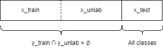
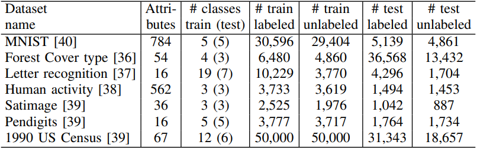
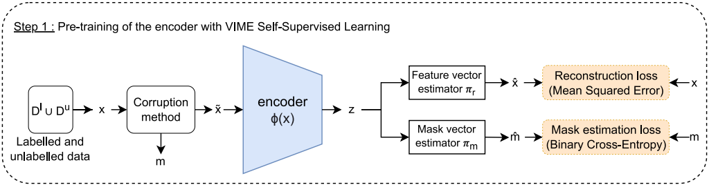
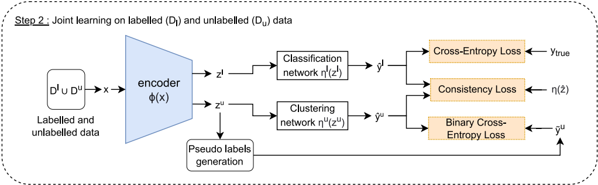

# TabularNCD :  A Method for Discovering Novel Classes in Tabular Data

Table of contents
  * [How the method works](#how-the-method-works)
  * [Virtualenv creation and packages installation](#virtualenv-creation-and-packages-installation)
  * [Script usage example](#script-usage-example)
  * [Detailed usage](#detailed-usage)
  * [Directory structure](#directory-structure)
  * [Explored hyper-parameters values ranges](#explored-hyper-parameters-values-ranges)
  * [Results](#results)
  * [Supplementary materials](#supplementary-materials)

-----
## How the method works

The datasets are split in this manner:

Some classes will be set as "unlabeled" and the model won't be able to train using their labels (they will only be used for evaluation during training).

Statistical information of the datasets evaluated in the ICDM 2022 paper can be found below:

The training process is illustrated below:

In step 1, the goal is to capture a common and informative representation of both x_train and x_unlab.\
Therefore, the encoder is pre-trained using all the available training data with self-supervised learning.\
This process is done with the VIME method, which corrupts some features of the inputs.\
The model is then trained to predict 1) the mask of the corrupted features (i.e. which features were corrupted) and 2) reconstruct the actual values of the inputs.

In this step, two new networks are added on top of the previously initialized encoder, each solving different tasks on different data.\
The first is a classification network trained to predict 1) the known classes from x_train with the ground-truth labels and 2) a single class formed of the aggregation of the unlabeled data.\
The second is another classification network trained to  predict the novel classes from x_unlab.

-----
## Note : Virtualenv creation and packages installation
This project was written using **python 3.7.9**. The libraries are described in requirements.txt.

It is recommended to create a virtual environment with *virtualenv* to install the exact versions of the packages used in this project.
You will first need to install *virtualenv* with pip:
> pip install virtualenv

Then create the virtual environment:
> virtualenv my_python_environment

Finally, activate it:
> .\my_python_environment\Scripts\activate

At this point, you should see the name of your virtual environment in parentheses on your terminal line.

You can now install the required libraries inside your virtual environment with:
> pip install -r requirements.txt

-----
## Script usage example
Display the help:
> python TabularNCD.py -h

> python Baseline.py -h

> python Clustering.py -h

TabularNCD example execution with the optimized hyper-parameters:
> python TabularNCD.py --dataset_name Pendigits --hyper_parameters_path auto

**Note:** To generate the results of the TabularNCD method from the results table, use the optimized hyper-parameters with the 'auto' value.

Baseline example execution:
> python Baseline.py --dataset_name Pendigits

Clustering example execution:
> python Clustering.py --dataset_name Pendigits --method kmeans --n_runs 5

-----
## Detailed usage

1. **TabularNCD.py**:
    * [required] dataset_name : The name of the dataset. Choices = ['mnist', 'ForestCoverType', 'LetterRecognition', 'HumanActivityRecognition', 'Satimage', 'Pendigits', 'USCensus1990'].
    * use_cuda : Set to True if you want the code to be run on your GPU. If set to False, code will run on CPU. Choices = ['True', 'False'].
    * log_lvl : Change the log display level. Choices = ['debug', 'info', 'warning'].
    * hyper_parameters_path : Path to the hyper-params file. Set to 'auto' to find it in .\data\dataset_name\hyperparameters.json
    * ssl_lr : Learning rate of the mode in the self-supervised learning phase.
    * lr_classif : Learning rate of the classification network in the joint learning phase.
    * lr_cluster : Learning rate of the clustering network in the joint learning phase.
    * encoder_layers_sizes : The sizes of the encoder's layers. Must include the input and output sizes.
    * ssl_layers_sizes : The hidden layers sizes of the mask and feature vector estimators. Do not include input and output sizes.
    * joint_learning_layers_sizes : The hidden layers sizes of the classification and clustering networks. Do not include input and output sizes.
    * activation_fct : The activation function used in the hidden layers of the encoder. Default = 'relu'. Choices = ['relu', 'sigmoid', 'tanh', None].
    * encoder_last_activation_fct : The activation function of the very last layer of the encoder. Default = None. Choices = ['relu', 'sigmoid', 'tanh', None].
    * ssl_last_activation_fct : The activation function of the very last layer of the feature estimator network. Default = None. Choices = ['relu', 'sigmoid', 'tanh', None].
    * joint_last_activation_fct : The activation function of the very last layer of the classification and clustering networks. Default = None. Choices = ['relu', 'sigmoid', 'tanh', None].
    * dropout : The dropout probability.
    * p_m :  Corruption probability
    * alpha : Loss_vime = mask_estim_loss + alpha * feature_estim_loss.
    * batch_size : Batch size of the joint learning step.
    * cosine_topk : The percentage of the maximum number of pairs in a mini-batch that are considered positive.
    * M : Size of the memory queue for the data augmentation method.
    * epochs : Number of joint training epochs.
    * transform_method : The variation of the SMOTE-NC insipired method. The \'old\' versions cannot handle categorical features.
    * k_neighbors : The number of neighbors to consider in the data augmentation method.
    * w1 : The classification network trade-off parameter.
    * w2 : The clustering network trade-off parameter.
    * pseudo_labels_method : The pseudo labels definition method. Default = 'top_k_cosine_per_instance'. Choices = ['cosine', 'top_k_cosine', 'top_k_cosine_faster', 'top_k_cosine_per_instance', 'ranking'].
    * use_ssl : Use SSL to initialize the encoder or not.
    * freeze_weights : Freeze the weights of the encoder's layer (except the last one) after SSL initialization or not. Choices = ['True', 'False'].

2. **Baseline.py**:
    * [required] dataset_name : The name of the dataset. Choices = ['mnist', 'ForestCoverType', 'LetterRecognition', 'HumanActivityRecognition', 'Satimage', 'Pendigits', 'USCensus1990'].
    * use_cuda : Set to True if you want the code to be run on your GPU. If set to False, code will run on CPU. Choices = ['True', 'False'].
    * log_lvl : Change the log display level. Choices = ['debug', 'info', 'warning'].

3. **Clustering.py**
   * [required] dataset_name : The name of the dataset. Choices = ['mnist', 'ForestCoverType', 'LetterRecognition', 'HumanActivityRecognition', 'Satimage', 'Pendigits', 'USCensus1990'].
   * [required] method : The clustering method to use. 'sc' refers to Spectral Clustering, and can be used with either the default implementation or the cosine similarity matrix. Choices = ['kmeans', 'default_sc', 'cosine_sc'].
   * log_lvl : Change the log display level. Choices = ['debug', 'info', 'warning'].
   * train_or_test : Compute on either the train or the test split. Choices = ['train', 'test'].
   * k_clusters : The number of clusters to used. Default is the ground truth.
   * n_runs : The number of executions, the results will be averaged.

-----
## Directory structure
    .
    ├── .gitignore
    ├── README.md                              <- This file
    ├── Supplementary_Materials_TabularNCD.pdf <- The supplementary materials
    ├── requirements.txt                       <- The required packages
    ├── Baseline.py                            <- The script to run the baseline method
    ├── Clustering.py                          <- The script to run any of the three clustering methods available
    ├── TabularNCD.py                          <- The script to run TabularNCD
    ├── data                                   <- The datasets (train & test) in csv, along with the hyper-parameters and links to download
    │   ├── ForestCoverType                    <- File is too large, please download and pre-process it before using dataset
    │   ├── HumanActivityRecognition           <- File is too large, please download and pre-process it before using dataset
    │   ├── LetterRecognition                  <- Dataset available
    │   ├── mnist                              <- Dataset available
    │   ├── Pendigits                          <- Dataset available
    │   ├── Satimage                           <- Dataset available
    │   └── USCensus1990                       <- File is too large, please download and pre-process it before using dataset
    ├── figures                                <- The training metrics curves
    └── src                                    <- The source code of the project
        ├── BaselineModel.py                   <- The Baseline model class
        ├── import_utils.py                    <- The functions to import the different datasets used here
        ├── loss_functions.py                  <- The loss functions used in training
        ├── ncl_memory_module.py               <- A simple class to store the M most recent training instances from the previous batches
        ├── TabularNCDModel.py                 <- The TabularNCD model class
        ├── training_procedures.py             <- The SSL and joint training methods
        ├── transforms.py                      <- The data augmentation methods
        └── utils.py                           <- Diverse useful functions

-----
## Explored hyper-parameters values ranges

For all datasets, the same ranges were explored:

  * lr_classif : uniform distribution of float in [0.000001, 0.01]
  * lr_cluster : uniform distribution of float in [0.000001, 0.01]
  * cosine_topk : uniform distribution of float in [1.0, 40.0]
  * k_neighbors : uniform distribution of int in [1, 50]
  * w1 : uniform distribution of float in [0.1, 1.0]
  * w2 : uniform distribution of float in [0.1, 1.0]
  * dropout : uniform distribution of float in [0.0, 0.60]
  * activation_fct : One of [Sigmoid, ReLU, None].

-----
## Results

| Dataset   | Method       | BACC (%) | ACC (%)  | NMI       | ARI       |
|-----------|--------------|:--------:|:--------:|:---------:|:---------:|
| MNIST     | Baseline     | 57.7±4.7 | 57.6±4.5 | 0.37±0.20 | 0.31±0.30 |
|           | Spect. clust | -        | -        | -         | -         |
|           | k-means      | 60.1±0.0 | 61.1±0.0 | 0.48±0.00 | 0.38±0.00 |
|           | TabularNCD   | 91.5±4.1 | 91.4±4.2 | 0.82±0.06 | 0.81±0.04 |
| Forest    | Baseline     | 55.6±2.0 | 68.5±1.4 | 0.27±0.02 | 0.15±0.01 |
|           | Spect. clust | 32.1±1.4 | 85.8±4.0 | 0.01±0.01 | 0.09±0.01 |
|           | k-means      | 32.9±0.0 | 62.0±0.0 | 0.04±0.00 | 0.05±0.00 |
|           | TabularNCD   | 66.8±0.6 | 92.2±0.2 | 0.37±0.09 | 0.56±0.09 |
| Letter    | Baseline     | 55.7±3.6 | 55.9±3.6 | 0.49±0.04 | 0.33±0.04 |
|           | Spect. clust | 45.3±4.0 | 45.3±4.0 | 0.48±0.03 | 0.18±0.03 |
|           | k-means      | 50.2±0.6 | 49.9±0.6 | 0.40±0.01 | 0.28±0.01 |
|           | TabularNCD   | 71.8±4.5 | 71.8±4.5 | 0.60±0.04 | 0.54±0.04 |
| Human     | Baseline     | 80.0±0.5 | 78.0±0.6 | 0.64±0.01 | 0.62±0.01 |
|           | Spect. clust | 70.2±0.0 | 69.4±0.0 | 0.72±0.00 | 0.60±0.00 |
|           | k-means      | 75.3±0.0 | 77.0±0.0 | 0.62±0.00 | 0.59±0.00 |
|           | TabularNCD   | 98.9±0.2 | 99.0±0.2 | 0.95±0.01 | 0.97±0.01 |
| Satimage  | Baseline     | 53.8±3.4 | 53.9±4.2 | 0.25±0.03 | 0.22±0.03 |
|           | Spect. clust | 82.2±0.1 | 77.8±0.1 | 0.51±0.00 | 0.46±0.00 |
|           | k-means      | 73.7±0.3 | 69.2±0.2 | 0.30±0.00 | 0.28±0.00 |
|           | TabularNCD   | 90.8±4.0 | 91.4±5.0 | 0.71±0.11 | 0.79±0.07 |
| Pendigits | Baseline     | 72.8±5.5 | 72.8±5.4 | 0.62±0.06 | 0.54±0.07 |
|           | Spect. clust | 84.0±0.0 | 84.0±0.0 | 0.78±0.00 | 0.67±0.00 |
|           | k-means      | 82.5±0.0 | 82.5±0.0 | 0.72±0.00 | 0.63±0.00 |
|           | TabularNCD   | 85.5±0.7 | 85.6±0.8 | 0.76±0.02 | 0.71±0.02 |
| Census    | Baseline     | 53.0±3.5 | 55.0±6.5 | 0.49±0.02 | 0.30±0.03 |
|           | Spect. clust | 23.6±3.3 | 51.3±5.5 | 0.24±0.11 | 0.18±0.09 |
|           | k-means      | 38.5±2.6 | 49.8±3.6 | 0.41±0.05 | 0.28±0.03 |
|           | TabularNCD   | 61.9±0.6 | 50.1±0.9 | 0.48±0.01 | 0.30±0.00 |

-----
## Supplementary materials

See the file ./Supplementary_Materials_TabularNCD.pdf
